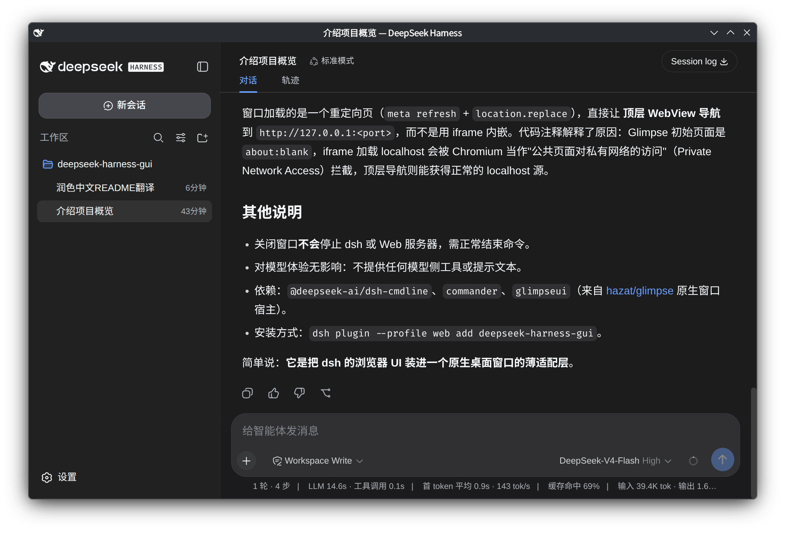

# deepseek-harness-gui

[English](README.md) | 中文

这是一个 dsh bundle 插件，用于在原生 [Glimpse](https://github.com/hazat/glimpse) 窗口中打开现有的 dsh Web GUI。插件刻意保持轻量：不会重复实现聊天功能，也不会引入第二套 RPC 桥接——窗口只是直接打开已绑定的本地 Web 服务。

## 界面截图

在原生 Glimpse 窗口中运行的 dsh Web GUI：



## 安装

将插件安装到 Web profile：

```sh
dsh plugin --profile web add --allow-build=glimpseui deepseek-harness-gui
```

`glimpseui` 内含一个平台原生宿主，需要在安装期间完成构建。较新版本的 pnpm 要求通过显式的 `--allow-build` 参数批准该构建脚本，否则会触发 `IGNORED_BUILDS` 错误。请仅在信任该依赖的前提下批准其构建脚本。

然后，带上 GUI 参数启动 dsh：

```sh
dsh web --gui
# 或：dsh --profile web --gui
```

该插件会替换默认的 Web 命令行参数提供者，使 `--gui` 参数能够被识别，同时保留 `--host`、`--port` 和 `--trusted-host` 参数。

## 环境要求

支持平台：Windows、macOS 和 Linux。

- 已完成前端构建的 dsh Web profile；
- dsh 所支持的 Node.js 版本；
- 当前平台所需的 Glimpse 原生宿主环境。

## 许可证

本项目以 MIT License 开源，完整的许可证文本请参阅 [LICENSE](LICENSE)。
